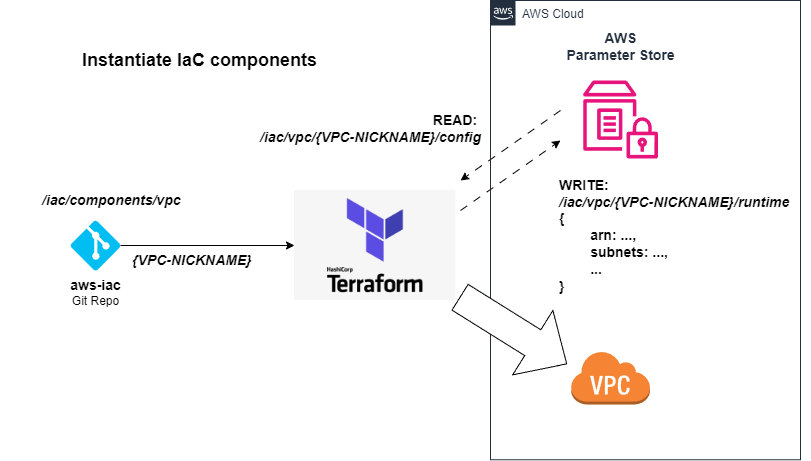

# Adage: A Configuration-Driven AWS Deployment Framework

## Overview

This repository explains how to implement a **Configuration-Driven AWS Deployment Model**, allowing you to:

- **Build AWS infrastructure once, then deploy dynamically via configuration updates**
- **Separate infrastructure (IaC), configuration (JSON), and application code (Lambdas)**
- **Resolve dependencies dynamically using AWS Parameter Store**
- **Ensure security and auditability by managing deployments through Git**

---

## How the Repositories Work Together

This model is composed of **three Git repositories** plus this documentation repo:

1. **[`aws-iac`](https://github.com/tstrall/aws-iac)** – Terraform modules for reusable AWS infrastructure
2. **[`aws-config`](https://github.com/tstrall/aws-config)** – Git-controlled JSON config, synced to Parameter Store
3. **[`aws-lambda`](https://github.com/tstrall/aws-lambda)** – Lambda functions that resolve their dependencies dynamically

This repository (**Adage**) provides a guided tour and design rationale for using them together.

---

## Quickstart: Build Your Own Serverless Static Website

Once your AWS account is bootstrapped and Identity Center is set up, follow this quickstart to deploy infrastructure for a serverless static site with CloudFront and S3:

👉 [Serverless Static Website Quickstart](./quickstarts/serverless-site.md)

---

## Deployment Flow

### 1. Push Configuration to AWS Parameter Store

Configuration is defined in `aws-config` and synced to Parameter Store using a CI/CD pipeline or script.

```
cd aws-config/
./scripts/deploy.sh <component> <nickname>
```

Each component finds its config under a path like:

```
/iac/<component>/<nickname>/config
```


The contents of AWS Parameter Store defines what can be deployed in a given account.

### 2. Deploy Using Terraform

In `aws-iac`, each component reads from AWS Parameter Store for configuration and writes its runtime outputs back to Parameter Store for other components to read:

```sh
cd aws-iac/
./scripts/deploy.sh <component> <nickname>
```

Each component publishes its runtime info under a path like:

```
/iac/<component>/<nickname>/runtime
```



➡️ [See AWS Deployment Strategies »](deployment/README.md)

---

## Core Design Principles

This project is guided by a fabric of ideas that enable scalable, secure, and flexible AWS infrastructure.

Each principle supports the others, forming a composable system where infrastructure, configuration, and services can evolve independently — yet always remain connected.

These principles include:

- **Build Once, Deploy Anywhere** – Reusable Terraform components across all environments.
- **Configuration Is the Source of Truth** – Git-controlled configs drive every deployment.
- **Immutable Infrastructure** – Replace rather than patch, enabling reliable rollouts.
- **Dynamic Dependency Resolution** – Services discover dependencies at runtime via nicknames.
- **Separation of Concerns** – Infra, config, and app code live in independent repos.
- **External System Referencing** – Reference systems you didn’t create as first-class citizens.
- **Git as the Gatekeeper** – Only what’s defined in Git gets deployed.
- **Optional Smart Caching** – Runtime refresh logic when failures occur.
- **LocalStack-Friendly by Default** – Develop and test locally with minimal cost.

➡️ [View the full explanation »](design-principles/README.md)

---

## Security & Compliance

- All changes must go through Git — providing version control and auditability
- IAM permissions can restrict who can modify configuration vs. who can deploy
- Parameter Store and Secrets Manager separate dynamic values from source code

---

## Next Steps

Want to implement this in your AWS environment?

1. **Fork and customize the three core repositories**
2. **Set up a CI/CD pipeline to sync config to Parameter Store**
3. **Define your IAM strategy and tag policies**
4. **Deploy your first component using the quickstart**

---

## Concepts & Further Reading

- [Configuration-Driven Design Principles](./design-principles/README.md)
- [Adaptive Runtime Behavior](./data-science/README.md) — How this architecture enables intelligent, self-adjusting systems

---

Like this approach? Star the repo, follow along, or use it as a base for your own architecture.
