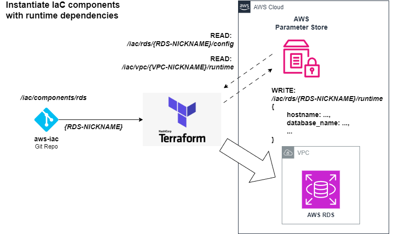
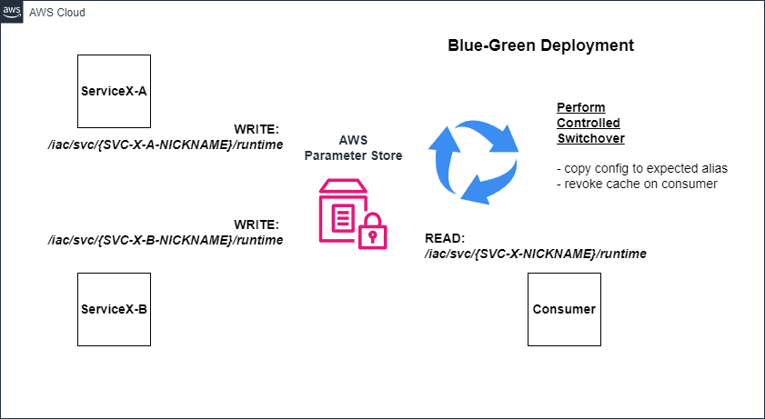
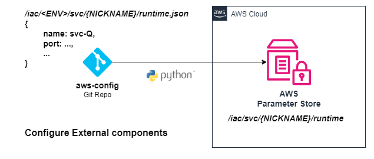

# AWS Deployment Strategies

## Basic Component Deployment


### 1. Push Configuration to AWS Parameter Store

Configuration is defined in `aws-config` and synced to Parameter Store using a CI/CD pipeline or script.

```
cd aws-config/
./scripts/deploy.sh <component> <nickname>
```

Each component finds its config under a path like:

```
/iac/<component>/<nickname>/config
```


The contents of AWS Parameter Store defines what can be deployed in a given account.

### 2. Deploy Using Terraform

In `aws-iac`, each component reads from AWS Parameter Store for configuration and writes its runtime outputs back to Parameter Store for other components to read:

```sh
cd aws-iac/
./scripts/deploy.sh <component> <nickname>
```

Each component publishes its runtime info under a path like:

```
/iac/<component>/<nickname>/runtime
```


## Component Deployment with Dependencies



## Blue-Green Component Deployment



## External Component Interaction


