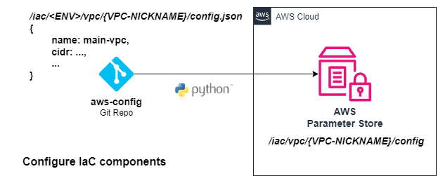

# AWS Deployment Strategies

## Table of Contents

- [Deployment Overview](#deployment-overview)
- [Basic Component Deployment](#basic-component-deployment)
  - [1. Push Configuration to AWS Parameter Store](#1-push-configuration-to-aws-parameter-store)
  - [2. Deploy Using Terraform](#2-deploy-using-terraform)
- [Component Deployment with Dependencies](#component-deployment-with-dependencies)
- [Blue-Green Component Deployment](#blue-green-component-deployment)
- [External Component Interaction](#external-component-interaction)

---

## Deployment Overview

This is a two-step deployment process:

1. **Push configuration to AWS Parameter Store**  
   Define your static site using the [`aws-config`](https://github.com/tstrall/aws-config) repository, and push the config to Parameter Store.

2. **Deploy infrastructure with Terraform**  
   Run Terraform from the [`aws-iac`](https://github.com/tstrall/aws-iac) repo. It reads the configuration from Parameter Store and builds the required AWS infrastructure.

All infrastructure is driven by config. Nothing gets deployed unless it’s defined in Parameter Store.

---

## Basic Component Deployment

### 1. Push Configuration to AWS Parameter Store

Configuration is defined in `aws-config` and synced to Parameter Store using a CI/CD pipeline or script.

```
cd aws-config/
./scripts/deploy.sh <component> <nickname>
```

Each component finds its config under a path like:

```
/iac/<component>/<nickname>/config
```



The contents of AWS Parameter Store defines what can be deployed in a given account.

### 2. Deploy Using Terraform

In `aws-iac`, each component reads from AWS Parameter Store for configuration and writes its runtime outputs back to Parameter Store for other components to read:

```sh
cd aws-iac/
./scripts/deploy.sh <component> <nickname>
```

Each component publishes its runtime info under a path like:

```
/iac/<component>/<nickname>/runtime
```


---

## Component Deployment with Dependencies


---

## Blue-Green Component Deployment


---

## External Component Interaction


