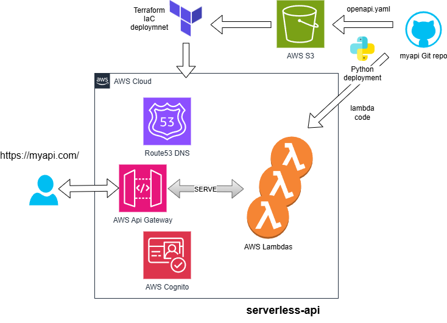

# Serverless API Quickstart



This guide walks you through deploying a serverless HTTP API using the `aws-openapi` and `aws-iac` repositories, following the Adage infrastructure model. You will:

* Define Lambda-backed routes using OpenAPI
* Deploy Lambda function infrastructure and code
* Wire routes dynamically to functions using `serverless-api`

---

## Before You Begin

Make sure your environment is configured correctly:

1. Complete the [Getting Started](../GETTING_STARTED.md) guide.
2. Authenticate with AWS:

```sh
aws sso login --profile prod-iac
```

3. Confirm access:

```sh
aws sts get-caller-identity --profile prod-iac
```

---

## Repositories Used

* [`aws-config`](https://github.com/usekarma/aws-config) – Parameter Store config definitions
* [`aws-iac`](https://github.com/usekarma/aws-iac) – Terraform infra modules
* [`aws-openapi`](https://github.com/usekarma/aws-openapi) – OpenAPI specs + Lambda code

---

## 1. Prepare Infrastructure (One-Time)

```sh
cd aws-config
AWS_PROFILE=prod-iac ./scripts/deploy.sh s3-bucket demo-api
AWS_PROFILE=prod-iac ./scripts/deploy.sh lambda demo-api
AWS_PROFILE=prod-iac ./scripts/deploy.sh serverless-api demo-api

cd ../aws-iac
AWS_PROFILE=prod-iac ./scripts/deploy.sh s3-bucket demo-api
AWS_PROFILE=prod-iac ./scripts/deploy.sh lambda demo-api
```

This creates the S3 bucket for storing OpenAPI specs and provisions Lambda function shells for `echo`, `status`, and `time`.

---

## 2. Deploy Lambda Code

```sh
cd ../aws-openapi
python scripts/deploy_lambda.py echo
python scripts/deploy_lambda.py status
python scripts/deploy_lambda.py time
```

This zips and deploys Lambda code to AWS and updates SSM with the function ARNs.

---

## 3. Deploy OpenAPI Spec

```sh
python scripts/deploy_openapi.py demo-api
```

This uploads `openapi/demo-api/openapi.yaml` to S3 and records its path in SSM.

---

## 4. Wire API Gateway

```sh
cd ../aws-iac
AWS_PROFILE=prod-iac ./scripts/deploy.sh serverless-api demo-api
```

Terraform will:

* Fetch the OpenAPI spec from S3
* Resolve Lambda nicknames using SSM
* Create an API Gateway HTTP API with all route integrations

---

## 5. Test the API

### If using a custom domain

If the returned value includes a `custom_domain` field, you can test directly using:

```sh
curl -X POST https://demo-api.usekarma.dev/echo \
  -d '{"msg": "hello"}' \
  -H 'Content-Type: application/json'

curl -X GET https://demo-api.usekarma.dev/status

curl -X GET https://demo-api.usekarma.dev/time
```

### If using the default API Gateway URL

```sh
aws ssm get-parameter \
  --name "/iac/serverless-api/demo-api/runtime" \
  --with-decryption \
  --query 'Parameter.Value' \
  --output text | jq .
```

Make sure to include the stage name (`/v1`) in the URL:

```sh
curl -X POST https://<api-id>.execute-api.us-east-1.amazonaws.com/v1/echo \
  -d '{"msg": "hello"}' \
  -H 'Content-Type: application/json'
```

---

## File Structure Summary

```text
aws-config/
  iac/
    prod/
      lambda/
        demo-api/
          config.json

aws-iac/
  components/
    lambda/
    serverless-api/

aws-openapi/
  openapi/
    demo-api/openapi.yaml
  lambdas/
    echo/main.py
    status/main.py
    time/main.py
```

---

## Tips

* You can update the OpenAPI spec anytime by rerunning `deploy_openapi.py` and `terraform apply` for `serverless-api`
* You can redeploy Lambda code independently without touching infra
* To add a new Lambda:

  1. Update `aws-config/lambda/demo-api/config.json`
  2. Redeploy `lambda` component
  3. Add handler code and run `deploy_lambda.py`
  4. Update OpenAPI and rewire with `serverless-api`

---

[Back to Adage Framework ←](../README.md)
