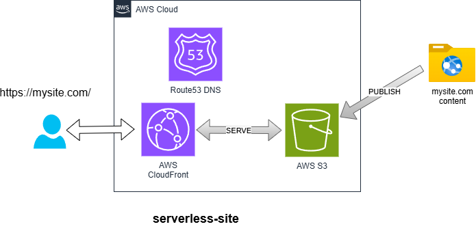

# Serverless Static Website Quickstart



This guide walks you through deploying a fully serverless, secure static website using:

- Amazon S3 for hosting HTML/JS assets  
- CloudFront for global CDN delivery  
- Route 53 for DNS and custom domain support  
- ACM for HTTPS certificates  
- IAM roles and tagging policies for security and cost visibility

---

## Before You Begin

If this is your first time working in AWS with this system, start here:

👉 [Getting Started](../GETTING_STARTED.md)

That guide walks you through creating a secure AWS account, enabling Identity Center, and setting up access. You’ll need that baseline in place before deploying infrastructure using this model.

Before running any deployment commands, make sure you're authenticated with AWS SSO:

```sh
aws sso login --profile management
```

This ensures that named profiles like `dev-iac` can assume their roles properly.

If you haven’t configured your AWS CLI profiles yet, follow the [AWS CLI Profile Setup Guide](../setup/aws-cli-profiles.md) to get started.

---

## Validate Before You Continue

Before proceeding to deployment, it's a good idea to confirm your CLI access, profiles, and local tools are set up correctly:

➡️ [Validate Your Setup](../validate_setup.md)

---

## Deployment Overview

This is a two-step deployment process:

1. **Push configuration to AWS Parameter Store**  
   Define your static site using the [`aws-config`](https://github.com/tstrall/aws-config) repository, and push the config to Parameter Store.

2. **Deploy infrastructure with Terraform**  
   Run Terraform from the [`aws-iac`](https://github.com/tstrall/aws-iac) repo. It reads the configuration from Parameter Store and builds the required AWS infrastructure.

All infrastructure is driven by config. Nothing gets deployed unless it’s defined in Parameter Store.

### See Also

- [AWS Deployment Strategies →](../deployment/README.md)

---

## Step-by-Step Plan

This Quickstart includes the following components:

### 1. DNS Setup (Route 53)

- **If your domain is already using AWS Route 53 as its name server**, you can skip this step.

- **If you do not have a DNS domain**, you can also skip this step.
  - Your site will still be accessible via an AWS-generated HTTPS URL.
  - Be sure to set `"enable_custom_domain": false` in your config at `aws-config/<ENV>/serverless-site/<NICKNAME>/config.json`:

    ```json
    {
      "site_name": "www.mysite.com",
      "enable_custom_domain": false,
      ...
    }
    ```

    Note: `"site_name"` should always be the actual domain name, even if you're not using a custom domain. This value is used internally for S3 bucket naming and CloudFront aliases.

- **Otherwise**, deploy the [`route53-zone`](https://github.com/tstrall/aws-iac/tree/main/components/route53-zone) component to configure AWS Route 53 as your domain’s DNS name server. That page also includes instructions for delegating DNS from GoDaddy.
  - Use the existing [`strall-com` config](https://github.com/tstrall/aws-config/blob/main/iac/prod/route53-zone/strall-com/config.json) as a reference.
  - That example includes an `MX` record for forwarding email through [ImprovMX](https://improvmx.com/).
    - **Remove the `MX` record** if you don’t want email forwarding.
    - **Otherwise**, create a free account on [ImprovMX](https://improvmx.com/) to enable email forwarding for your domain.

To deploy:

```sh
cd aws-config/
AWS_PROFILE=dev-iac ./scripts/deploy.sh route53-zone <nickname>
```

```sh
cd aws-iac/
AWS_PROFILE=dev-iac ./scripts/deploy.sh route53-zone <nickname>
```

---

### 2. Deploy AWS Infrastructure

- Define your website configuration in:
  `aws-config/iac/<ENV>/serverless-site/<NICKNAME>/config.json`
- Use the [`strall-com` example](https://github.com/tstrall/aws-config/blob/main/iac/prod/serverless-site/strall-com/config.json) as a reference.

To deploy:

```sh
cd aws-config/
AWS_PROFILE=dev-iac ./scripts/deploy.sh serverless-site <nickname>
```

```sh
cd aws-iac/
AWS_PROFILE=dev-iac ./scripts/deploy.sh serverless-site <nickname>
```

To remove the infrastructure later:

```sh
cd aws-iac/
AWS_PROFILE=dev-iac ./scripts/deploy.sh serverless-site <nickname> --destroy
```

This will remove the deployed AWS resources but **will not delete** your config from Parameter Store or Git. You can redeploy it again at any time.

---

### 3. Deploy Static Website

- See the [strall.com](https://github.com/tstrall/strall.com) repository for a static site example.

To publish your content:

```sh
cd strall.com/
AWS_PROFILE=dev-iac ./scripts/deploy.sh serverless-site <nickname>
```

---

## Verify Deployment

Once you've published your site, visit:

- `https://<custom_domain>` if you configured Route 53 + ACM
- Or check the runtime parameter for your CloudFront URL:

```sh
aws ssm get-parameter \
  --name "/iac/serverless-site/<nickname>/runtime" \
  --with-decryption \
  --query 'Parameter.Value' \
  --output text | jq .
```

Look for the `custom_domain` or `cloudfront_distribution_domain` field in the output.

---

## File Structure Summary

```text
aws-config/
  iac/
    dev/
      serverless-site/
        mydemo/
          config.json

aws-iac/
  components/
    serverless-site/
      main.tf
```

---

## Repositories Involved

- [`aws-iac`](https://github.com/tstrall/aws-iac) – Terraform modules  
- [`aws-config`](https://github.com/tstrall/aws-config) – JSON-based configuration definitions  
- [`strall.com`](https://github.com/tstrall/strall.com) – Example static site and publishing workflow  

---

[Back to Adage: AWS Deployment Framework ←](../README.md)

